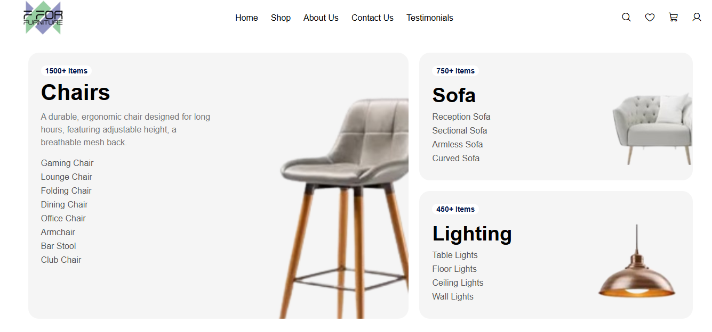
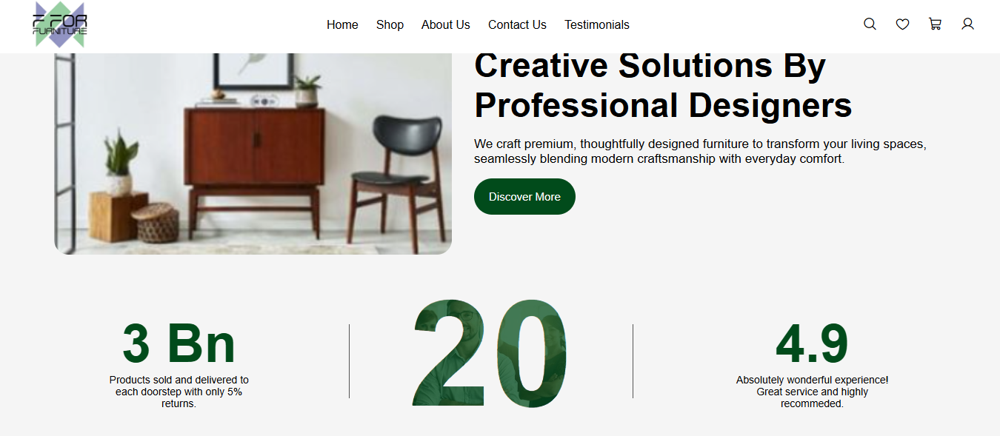

# F For Furniture
A shopping website if you want to buy furniture. I found this while I was searching for the [Arlecchino Tribute Page](https://raghacchino.github.io/arlecchino-tribute-website/) on Pinterest. I liked it so I thought I could make it. 

## Features
- a css carousel on the hero section
- a grid layout but without using display grid
- an about us page with text that has an img as background
- a contact us page
- a footer

## Credits
Design inspiration linked here [pin](https://in.pinterest.com/pin/1122311169750452572/)
The video from which I took help to make the [carousel](https://www.youtube.com/watch?v=gmI5nvzv170&t)